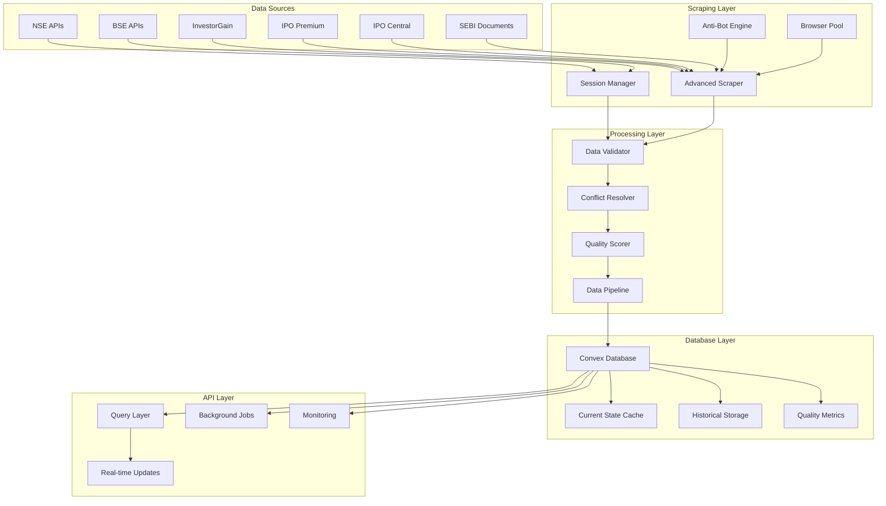

# IPO Dalal Backend - Comprehensive Implementation Plan

## Executive Summary

This plan outlines the implementation of a comprehensive multi-source IPO data platform that transforms the current basic database into an enterprise-grade system capable of:
- Real-time data ingestion from 10+ sources
- Advanced anti-bot web scraping
- Multi-exchange API integration (NSE/BSE)
- Intelligent data validation and conflict resolution
- Sub-minute data freshness
- 99.9% uptime with automatic failover

## Current State Analysis

**✅ Already Implemented:**
- Basic Convex database with core IPO tables
- Simple GMP and subscription tracking
- Frontend components and admin panel
- TypeScript type system
- Basic seeding functionality

**❌ Missing (From Updated PRD):**
- Multi-source data integration (NSE APIs, premium scrapers)
- Enhanced database schema (bid details, demand charts, SEBI docs)
- Advanced scraping with anti-bot measures
- Session management for APIs
- Real-time processing pipeline
- Quality scoring and conflict resolution

---

## Detailed Implementation Phases

### Phase 1: Enhanced Database Schema Implementation

**Objective:** Extend current schema to support multi-source data architecture

**Key Changes:**
```typescript
// New tables to add to convex/schema.ts
nse_bid_details: defineTable({...})     // NSE bid tracking
nse_demand_chart: defineTable({...})    // NSE demand data
sebi_documents: defineTable({...})      // Document tracking
data_sources: defineTable({...})        // Source configuration
scrape_sessions: defineTable({...})     // Session management
quality_metrics: defineTable({...})     // Data quality tracking
```

**Enhanced IPO table:**
```typescript
ipos: defineTable({
  // Add fields for multi-source support
  symbol: v.string(),                    // NSE/BSE symbol
  series: v.union(v.literal("EQ"), v.literal("SME")),
  dataSource: v.array(v.string()),       // Multiple sources
  qualityScore: v.number(),              // 0-100
  lastUpdated: v.number(),
  // NSE specific fields
  noOfSharesOffered: v.optional(v.number()),
  noOfSharesBid: v.optional(v.number()),
  subscriptionMultiple: v.optional(v.number()),
})
```

**Deliverables:**
- Extended `convex/schema.ts`
- New types in `types/database.ts`
- Migration functions for existing data
- Updated validation functions

---

### Phase 2: NSE/BSE API Integration Layer

**Objective:** Build robust API clients for official exchange data

**NSE Integration:**
```typescript
// lib/integrations/nse-client.ts
class NSEClient {
  private sessionManager: SessionManager;
  private endpoints = {
    marketStatus: 'https://www.nseindia.com/api/marketStatus',
    currentIPOs: 'https://www.nseindia.com/api/ipo-current-issue',
    bidDetails: 'https://www.nseindia.com/api/ipo-bid-details',
    demandChart: 'https://www.nseindia.com/api/ipo-chart-demand'
  };
  
  async getCurrentIPOs(): Promise<IPOData[]>
  async getBidDetails(symbol: string, series: string): Promise<BidData>
  async getDemandChart(symbol: string): Promise<DemandData[]>
}
```

**Session Management:**
```typescript
// lib/session/session-manager.ts
class SessionManager {
  async warmupSession(symbol: string, series: string): Promise<void>
  getHeaders(referrer?: string): Record<string, string>
  manageCookies(): Promise<void>
  rotateSession(): Promise<void>
}
```

**Deliverables:**
- NSE API client with session management
- BSE API client (similar structure)
- Authentication and rate limiting
- Error handling and retry logic
- Convex actions for API calls

---

### Phase 3: Advanced Web Scraping Infrastructure

**Objective:** Build anti-bot scraping system for premium sources

**Core Scraping Engine:**
```typescript
// lib/scraping/advanced-scraper.ts
class AdvancedScraper {
  private browserPool: Browser[];
  private proxyPool: string[];
  private userAgents: string[];
  
  async scrapeWithAntiBot(config: ScrapingConfig): Promise<ScrapingResult>
  private async applyAntiDetectionMeasures(page: Page): Promise<void>
  private async addRandomDelay(min: number, max: number): Promise<void>
  private async bypassCaptcha(page: Page): Promise<boolean>
}
```

**Premium Source Scrapers:**
```typescript
// lib/scrapers/investor-gain.ts
export class InvestorGainScraper extends AdvancedScraper {
  async scrapeGMPTable(): Promise<GMPData[]>
  async scrapeSaudaRates(companyUrl: string): Promise<SaudaRates>
}

// lib/scrapers/ipo-premium.ts
export class IPOPremiumScraper extends AdvancedScraper {
  async scrapeMainTable(): Promise<IPOData[]>
}
```

**Anti-Bot Measures:**
- User-Agent rotation
- Proxy rotation
- Browser fingerprint randomization
- Human-like interaction patterns
- CAPTCHA detection and handling
- Request rate limiting

**Deliverables:**
- Base scraper class with anti-bot capabilities
- Individual scrapers for each premium source
- Browser pool management
- Proxy configuration and rotation
- CAPTCHA handling system

---

### Phase 4: Multi-Source Data Processing Pipeline

**Objective:** Build intelligent data aggregation and conflict resolution

**Data Validation Engine:**
```typescript
// lib/processing/data-validator.ts
class DataValidator {
  validateGMPData(data: GMPData): ValidationResult
  validateSubscriptionData(data: SubscriptionData): ValidationResult
  validateIPODetails(data: IPODetails): ValidationResult
  checkDataConsistency(sources: DataSource[]): ConsistencyReport
}
```

**Conflict Resolution:**
```typescript
// lib/processing/conflict-resolver.ts
class ConflictResolver {
  resolveGMPConflicts(sources: GMPSource[]): ResolvedGMP
  resolveSubscriptionConflicts(sources: SubSource[]): ResolvedSubscription
  calculateConfidenceScore(resolution: Resolution): number
  applySourcePriority(conflicts: Conflict[]): ResolvedData
}
```

**Quality Scoring:**
```typescript
// lib/processing/quality-scorer.ts
class QualityScorer {
  scoreDataFreshness(timestamp: number): number
  scoreSourceReliability(source: string): number
  scoreDataConsistency(crossCheck: CrossCheckResult): number
  calculateOverallScore(metrics: QualityMetrics): number
}
```

**Deliverables:**
- Data validation and sanitization
- Cross-source conflict resolution
- Quality scoring system
- Data transformation pipeline
- Batch processing optimization

---

### Phase 5: Session Management & Anti-Bot Systems

**Objective:** Maintain persistent sessions for reliable data access

**Session Pool Management:**
```typescript
// lib/session/session-pool.ts
class SessionPool {
  private activeSessions: Map<string, SessionData>;
  private sessionQueue: Queue<SessionRequest>;
  
  async getSession(identifier: string): Promise<SessionData>
  async releaseSession(identifier: string): Promise<void>
  async warmupSessions(count: number): Promise<void>
  async rotateExpiredSessions(): Promise<void>
}
```

**Anti-Detection System:**
```typescript
// lib/anti-bot/stealth-manager.ts
class StealthManager {
  async setupStealthBrowser(): Promise<Browser>
  async randomizeFingerprint(page: Page): Promise<void>
  async simulateHumanBehavior(page: Page): Promise<void>
  async handleChallenges(page: Page): Promise<boolean>
}
```

**Deliverables:**
- Session pool with automatic rotation
- Anti-detection browser configuration
- Human behavior simulation
- Challenge detection and handling
- Session health monitoring

---

### Phase 6: SEBI Document Integration

**Objective:** Scrape and index regulatory documents

**SEBI Scraper:**
```typescript
// lib/scrapers/sebi-scraper.ts
class SEBIScraper extends AdvancedScraper {
  async scrapeDRHP(): Promise<SEBIDocument[]>
  async scrapeRHP(): Promise<SEBIDocument[]>
  async scrapeFinalOffer(): Promise<SEBIDocument[]>
  async scrapeSMEDocuments(): Promise<SEBIDocument[]>
}
```

**Document Processing:**
```typescript
// lib/document/sebi-processor.ts
class SEBIDocumentProcessor {
  async extractMetadata(document: SEBIDocument): Promise<DocumentMetadata>
  async linkToIPO(document: SEBIDocument): Promise<IPOMatch>
  async validateDocument(document: SEBIDocument): Promise<ValidationResult>
}
```

**Deliverables:**
- SEBI website scraper
- Document metadata extraction
- IPO-document linking system
- Document validation and storage

---

### Phase 7: Background Processing & Scheduling

**Objective:** Automated data collection and processing

**Scheduler System:**
```typescript
// lib/scheduler/cron-scheduler.ts
class CronScheduler {
  // Every 5 minutes during market hours
  @Cron('*/5 9-15 * * 1-5')
  async scrapeActiveIPOs(): Promise<void>
  
  // Every 30 minutes
  @Cron('*/30 * * * *')
  async scrapeGMPData(): Promise<void>
  
  // Every hour
  @Cron('0 * * * *')
  async validateDataQuality(): Promise<void>
}
```

**Convex Actions Integration:**
```typescript
// convex/actions/data-collection.ts
export const collectNSEData = action({
  handler: async (ctx) => {
    const nseClient = new NSEClient();
    const data = await nseClient.getCurrentIPOs();
    await ctx.runMutation(api.ipo_functions.insertIPOBatch, { data });
  }
});
```

**Deliverables:**
- Scheduled data collection jobs
- Background processing actions
- Error handling and recovery
- Job status monitoring
- Performance optimization

---

### Phase 8: Monitoring & Health Checks

**Objective:** Comprehensive system monitoring and alerting

**Health Monitoring:**
```typescript
// lib/monitoring/health-checker.ts
class HealthChecker {
  async checkDataFreshness(): Promise<HealthStatus>
  async checkScrapingSuccess(): Promise<HealthStatus>
  async checkAPIConnectivity(): Promise<HealthStatus>
  async checkDatabasePerformance(): Promise<HealthStatus>
}
```

**Alerting System:**
```typescript
// lib/monitoring/alerting.ts
class AlertingService {
  async sendDataStalenessAlert(staleness: number): Promise<void>
  async sendScrapingFailureAlert(source: string): Promise<void>
  async sendPerformanceAlert(metrics: PerformanceMetrics): Promise<void>
}
```

**Deliverables:**
- Real-time health monitoring
- Performance metrics collection
- Automated alerting system
- Dashboard for system status
- Error tracking and logging

---

### Phase 9: API Enhancement & Performance

**Objective:** Optimize existing APIs and add new endpoints

**Enhanced Query Functions:**
```typescript
// convex/enhanced_queries.ts
export const getMultiSourceGMP = query({
  // Cross-reference multiple sources
  // Return confidence intervals
  // Include data freshness metrics
});

export const getIPOAnalytics = query({
  // Historical trend analysis
  // Predictive insights
  // Comparative analysis
});
```

**Real-time Updates:**
```typescript
// lib/realtime/websocket-manager.ts
class WebSocketManager {
  broadcastGMPUpdate(ipoId: string, data: GMPUpdate): void
  broadcastSubscriptionUpdate(ipoId: string, data: SubUpdate): void
  broadcastSystemAlert(alert: SystemAlert): void
}
```

**Deliverables:**
- Enhanced query performance
- Real-time data streaming
- Advanced analytics endpoints
- Caching optimization
- API rate limiting

---

### Phase 10: Testing & Quality Assurance

**Objective:** Comprehensive testing and validation

**Testing Strategy:**
```typescript
// tests/integration/scraping.test.ts
describe('Multi-Source Scraping', () => {
  test('should scrape all sources without detection')
  test('should handle rate limiting gracefully')
  test('should resolve data conflicts correctly')
});

// tests/performance/load.test.ts
describe('Performance Tests', () => {
  test('should handle 1000 concurrent requests')
  test('should maintain sub-500ms response times')
});
```

**Quality Assurance:**
- Unit tests for all components
- Integration tests for data flow
- Performance testing under load
- Security testing for scraping
- Data quality validation

**Deliverables:**
- Comprehensive test suite
- Performance benchmarks
- Security audit results
- Data quality reports
- Deployment readiness checklist

---

## Architecture Diagram



## Technology Stack Requirements

**Additional Dependencies:**
```json
{
  "dependencies": {
    "puppeteer-extra": "^3.3.6",
    "puppeteer-extra-plugin-stealth": "^2.11.2",
    "puppeteer-extra-plugin-recaptcha": "^3.6.8",
    "playwright": "^1.40.0",
    "cheerio": "^1.0.0-rc.12",
    "axios": "^1.6.0",
    "tough-cookie": "^4.1.3",
    "proxy-agent": "^6.3.1",
    "cron": "^3.1.6",
    "redis": "^4.6.10",
    "winston": "^3.11.0"
  }
}
```

## Implementation Timeline

| Phase | Duration | Dependencies | Risk Level |
|-------|----------|--------------|------------|
| Phase 1 | 1 week | Current schema | Low |
| Phase 2 | 2 weeks | Phase 1 | Medium |
| Phase 3 | 3 weeks | Phase 1 | High |
| Phase 4 | 2 weeks | Phase 2,3 | Medium |
| Phase 5 | 1 week | Phase 3 | Medium |
| Phase 6 | 1 week | Phase 3,5 | Low |
| Phase 7 | 2 weeks | Phase 2,3,4 | Medium |
| Phase 8 | 1 week | All phases | Low |
| Phase 9 | 2 weeks | Phase 1,4,7 | Medium |
| Phase 10 | 2 weeks | All phases | Low |

**Total Estimated Duration: 17 weeks**

## Success Metrics

1. **Data Freshness**: < 5 minutes for critical IPO data
2. **Uptime**: 99.9% system availability
3. **Response Time**: < 500ms for dashboard queries
4. **Data Quality**: > 95% accuracy across sources
5. **Scraping Success**: > 90% successful scraping rate
6. **Conflict Resolution**: < 1% unresolved data conflicts

## Risk Assessment

### High Risk Areas
1. **Web Scraping Stability** - Premium sites may change layouts or add new anti-bot measures
2. **NSE API Rate Limits** - Official APIs may have undocumented rate limits
3. **Session Management** - Complex cookie and session handling for multiple sources

### Mitigation Strategies
1. **Modular Design** - Each scraper is independent, failure of one doesn't affect others
2. **Fallback Sources** - Multiple sources for critical data points
3. **Graceful Degradation** - System continues operating with reduced functionality
4. **Monitoring & Alerts** - Early detection of issues with automated recovery

## Deployment Strategy

### Development Environment
- Local development with mock data sources
- Docker containers for consistent environment
- Feature flags for gradual rollout

### Staging Environment
- Full replica of production environment
- Real data sources with rate limiting
- Performance and load testing

### Production Deployment
- Blue-green deployment strategy
- Gradual rollout with monitoring
- Automatic rollback capabilities
- Health checks and circuit breakers

This comprehensive plan transforms the current basic IPO database into an enterprise-grade, multi-source data platform capable of real-time IPO tracking with advanced scraping and data processing capabilities.