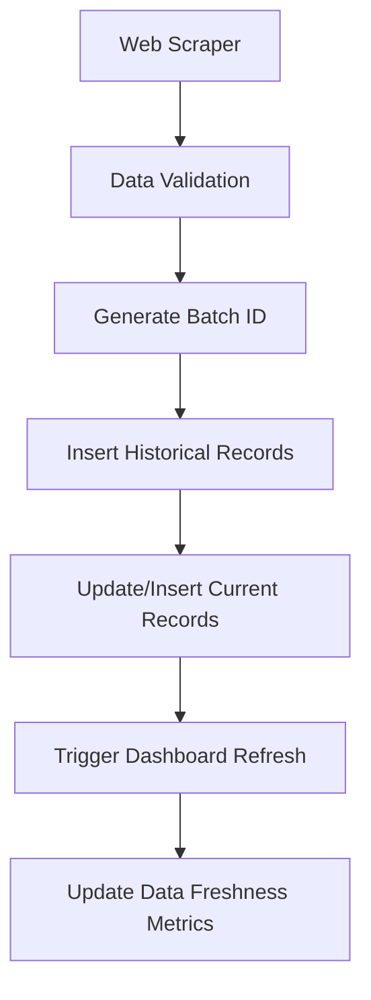

# IPO Database Architecture - PRD

## 1. Overview

### 1.1 Purpose
This document defines the database architecture for the IPO Dashboard system that aggregates IPO data from multiple sources (starting with InvestorGain) and provides real-time dashboards for GMP tracking, subscription monitoring, and comprehensive IPO analysis.

### 1.2 Objectives
- **Historical Data Preservation**: Maintain complete audit trail of all scraped data
- **Dashboard Performance**: Provide fast queries for real-time dashboards
- **Scalability**: Support multiple data sources and growing data volume
- **Data Integrity**: Ensure consistent and reliable data across all views

### 1.3 Technology Stack
- **Database**: Convex (Document-based, real-time)
- **Architecture Pattern**: Time-series with current state caching
- **Data Sources**: InvestorGain (initial), expandable to Chittorgarh, etc.

## 2. Database Schema

### 2.1 Table Structure Overview

| Table Name | Type | Purpose | Record Count |
|------------|------|---------|--------------|
| `ipos` | Master | Static IPO information | ~50-100 |
| `gmp_history` | Time-series | Historical GMP data | Growing daily |
| `subscription_history` | Time-series | Historical subscription data | Growing daily |
| `current_gmp` | Cache | Latest GMP for dashboards | ~50-100 |
| `current_subscription` | Cache | Latest subscription for dashboards | ~50-100 |

### 2.2 Detailed Schema Definitions

#### 2.2.1 Master IPO Table (`ipos`)

```typescript
{
  _id: Id<"ipos">,                    // Convex auto-generated
  _creationTime: number,              // Convex auto-generated
  
  // Basic Information
  company_name: string,               // "ABC Technologies Ltd"
  type: "BSE SME" | "NSE SME" | "Mainline",          // IPO category
  ipo_size_cr: number,               // Size in crores
  
  // Pricing Information
  price_per_share: number,           // Upper band/cutoff price
  lot_size: number,                  // General lot size
  retail_min_lot_size: number,       // Minimum retail lot size
  shni_min_lot_size: number,         // Minimum SHNI lot size
  bhni_min_lot_size: number,         // Minimum BHNI lot size
  
  // Important Dates
  closing_date: string,              // ISO date format
  allotment_date: string,            // ISO date format
  refund_date: string,               // ISO date format
  listing_date: string,              // ISO date format
  
  // Status Management
  status: "upcoming" | "open" | "closed" | "listed", //needs to be updated based on current time. default will be upcoming. 
  
  // Metadata
  created_by: string,                // System/manual entry tracking
  last_modified: number              // Last update timestamp
}
```

**Indexes:**
- `by_company`: `["company_name"]`
- `by_type_status`: `["type", "status"]`
- `by_closing_date`: `["closing_date"]`

#### 2.2.2 GMP Historical Data (`gmp_history`)

```typescript
{
  _id: Id<"gmp_history">,
  _creationTime: number,
  
  // Reference
  ipo_id: Id<"ipos">,               // Foreign key reference
  
  // Temporal Information
  timestamp: number,                 // Unix timestamp (exact time)
  date: string,                     // ISO date (YYYY-MM-DD) for grouping
  
  // GMP Data
  gmp_percent: number,              // Grey Market Premium percentage
  gmp_price: number,                // GMP in rupees (calculated)
  
  // Trading Rates
  kostak_rates: number,             // Kostak rates
  retail_sauda_rates: number,       // Subject to sauda (retail)
  shni_sauda_rates: number | null,  // Subject to sauda (SHNI), null for SME
  
  // Data Source Tracking
  source: string,                   // "InvestorGain", "Chittorgarh", etc.
  scrape_batch_id: string,          // Batch identifier for grouping
  
  // Data Quality
  confidence_score: number | null,   // Future: data reliability score
  is_verified: boolean | null       // Future: manual verification flag
}
```

**Indexes:**
- `by_ipo_and_date`: `["ipo_id", "date"]`
- `by_timestamp`: `["timestamp"]`
- `by_batch`: `["scrape_batch_id"]`
- `by_source`: `["source", "timestamp"]`

#### 2.2.3 Subscription Historical Data (`subscription_history`)

```typescript
{
  _id: Id<"subscription_history">,
  _creationTime: number,
  
  // Reference
  ipo_id: Id<"ipos">,
  
  // Temporal Information
  timestamp: number,
  date: string,
  
  // Subscription Data by Category
  qib_sub: number,                  // QIB subscription multiple
  bhni_sub: number,                 // BHNI subscription multiple
  shni_sub: number,                 // SHNI subscription multiple
  retail_sub: number,               // Retail subscription multiple
  emp_sub: number,                  // Employee subscription multiple
  sh_sub: number,                   // Shareholder subscription multiple
  
  // Aggregate Data
  total_sub: number,                // Total subscription multiple
  total_amount_applied: number,     // Total amount applied (crores)
  
  // Data Source Tracking
  source: string,
  scrape_batch_id: string,
  
}
```

**Indexes:**
- `by_ipo_and_date`: `["ipo_id", "date"]`
- `by_timestamp`: `["timestamp"]`
- `by_batch`: `["scrape_batch_id"]`

#### 2.2.4 Current GMP Data (`current_gmp`)

```typescript
{
  _id: Id<"current_gmp">,
  _creationTime: number,
  
  // Reference
  ipo_id: Id<"ipos">,              // One-to-one relationship
  
  // Latest Data (mirrors gmp_history structure)
  gmp_percent: number,
  gmp_price: number,
  kostak_rates: number,
  retail_sauda_rates: number,
  shni_sauda_rates: number | null,
  
  // Metadata
  source: string,                   // Source of latest data
  last_updated: number,            // When this was last updated
  data_freshness: number,          // Age of data in minutes
  
  // Calculated Fields (computed at update time)
  est_listing_price: number,       // price_per_share + gmp_price
  est_retail_profit: number,       // Estimated profit for retail investors
  est_shni_profit: number | null   // Estimated profit for SHNI (null for SME)
}
```

**Indexes:**
- `by_ipo`: `["ipo_id"]` (unique)
- `by_last_updated`: `["last_updated"]`

#### 2.2.5 Current Subscription Data (`current_subscription`)

```typescript
{
  _id: Id<"current_subscription">,
  _creationTime: number,
  
  // Reference
  ipo_id: Id<"ipos">,
  
  // Latest Subscription Data
  qib_sub: number,
  bhni_sub: number,
  shni_sub: number,
  retail_sub: number,
  emp_sub: number,
  sh_sub: number,
  total_sub: number,
  total_amount_applied: number,
  
  // Metadata
  source: string,
  last_updated: number,
  data_freshness: number,
  
}
```

**Indexes:**
- `by_ipo`: `["ipo_id"]` (unique)
- `by_total_sub`: `["total_sub"]`

## 3. Data Flow Architecture

### 3.1 Data Ingestion Process



### 3.2 Batch Processing Logic

#### 3.2.1 Batch ID Generation
```typescript
const generateBatchId = (source: string): string => {
  return `${source.toLowerCase()}_${Date.now()}_${Math.random().toString(36).substr(2, 9)}`;
}

// Example: "investorgain_1705397400000_k7x2m4n8p"
```

#### 3.2.2 Data Validation Rules
- **GMP Percentage**: Must be between -50% and +200%
- **Subscription Numbers**: Must be >= 0
- **Dates**: Must be valid ISO format
- **Required Fields**: All non-nullable fields must have values
- **Data Consistency**: Current data must match latest historical entry

### 3.3 Update Strategies

#### 3.3.1 Historical Data (Append-Only)
- Every scrape creates new records
- Never update or delete existing records
- Maintains complete audit trail

#### 3.3.2 Current Data (Upsert)
- Update existing record if present
- Insert new record if not present
- Always reflects latest scraped data

## 4. API Design

### 4.1 Mutation Functions

#### 4.1.1 Insert GMP Data
```typescript
export const insertGMPBatch = mutation({
  args: {
    gmp_data_array: v.array(v.object({
      ipo_id: v.id("ipos"),
      gmp_percent: v.number(),
      price_per_share: v.number(),
      kostak_rates: v.number(),
      retail_sauda_rates: v.number(),
      shni_sauda_rates: v.optional(v.number()),
    })),
    source: v.string(),
    batch_metadata: v.optional(v.object({
      scraper_version: v.string(),
      scrape_duration_ms: v.number(),
    }))
  },
  handler: async (ctx, args) => {
    // Implementation details in technical spec
  }
});
```

#### 4.1.2 Insert Subscription Data
```typescript
export const insertSubscriptionBatch = mutation({
  args: {
    subscription_data_array: v.array(v.object({
      ipo_id: v.id("ipos"),
      qib_sub: v.number(),
      bhni_sub: v.number(),
      shni_sub: v.number(),
      retail_sub: v.number(),
      emp_sub: v.number(),
      sh_sub: v.number(),
      total_amount_applied: v.number(),
    })),
    source: v.string(),
  },
  handler: async (ctx, args) => {
    // Implementation details in technical spec
  }
});
```

### 4.2 Query Functions

#### 4.2.1 Dashboard Queries
```typescript
// Home Dashboard Data
export const getDashboardData = query({
  handler: async (ctx) => {
    // Join ipos + current_gmp + current_subscription
    // Return enriched data for dashboard
  }
});

// GMP Aggregator Data
export const getGMPAggregatorData = query({
  args: { 
    filter_type: v.optional(v.union(v.literal("SME"), v.literal("Mainline"))),
    sort_by: v.optional(v.string())
  },
  handler: async (ctx, args) => {
    // Return GMP data with calculated fields
  }
});

// Subscription Aggregator Data
export const getSubscriptionAggregatorData = query({
  handler: async (ctx) => {
    // Return subscription data with totals
  }
});
```

#### 4.2.2 Historical Queries
```typescript
// GMP History for Charts
export const getGMPHistory = query({
  args: { 
    ipo_id: v.id("ipos"), 
    days: v.optional(v.number()),
    source: v.optional(v.string())
  },
  handler: async (ctx, args) => {
    // Return time-series data for charting
  }
});

// Subscription Trends
export const getSubscriptionTrends = query({
  args: { 
    ipo_id: v.id("ipos"), 
    hours: v.optional(v.number())
  },
  handler: async (ctx, args) => {
    // Return subscription progression over time
  }
});
```

## 5. Performance Considerations

- **Current Tables**: Small, frequently accessed, heavily indexed
- **Historical Tables**: Partitioned by date, indexed for time-range queries
- **Calculated Fields**: Computed during write, not read
- **Error Handling**: Graceful fallback for failed updates

## 6. Data Quality & Monitoring

### 6.1 Data Validation
- **Schema Validation**: Strict type checking on all inputs
- **Duplicate Detection**: Prevent duplicate entries within same batch

## 7. Security & Access Control

### 7.1 Data Access
- **Read Access**: Public for dashboard queries
- **Write Access**: Restricted to scraper services only
- **Admin Access**: Full CRUD for data management

### 7.2 API Security
- **Rate Limiting**: Prevent abuse of query endpoints
- **Input Validation**: Sanitize all user inputs
- **Authentication**: API keys for scraper services

## 8. Success Metrics

### 8.1 Performance Metrics
- **Dashboard Load Time**: < 2 seconds for all views
- **Data Freshness**: < 30 minutes for all IPO data
- **Uptime**: 99.9% availability target

### 8.2 Data Quality Metrics
- **Completeness**: > 95% of expected data points collected
- **Accuracy**: < 1% error rate in scraped data
- **Consistency**: Zero data conflicts across dashboards

### 8.3 User Experience Metrics
- **Real-time Updates**: Dashboard updates within 5 minutes of data scrape
- **Historical Coverage**: Complete data history preserved
- **Multi-device Support**: Responsive design across all devices

